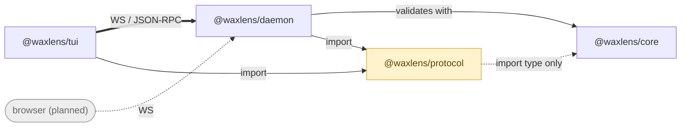

## The four packages

| Package | bin | Role |
| ------- | --- | ---- |
| `@waxlens/core` | `waxlens-validate` | The validation engine. Reads a WACZ, runs the rules, produces a machine-readable report. Usable directly from CI without the rest. |
| `@waxlens/daemon` | `waxlens-daemon` | A stateless HTTP/WS daemon that owns core and answers with a resolved report (message, spec URL and conformance inlined). |
| `@waxlens/tui` | `waxlens` | The interactive terminal UI — a thin client of the daemon. |
| `@waxlens/protocol` | — | The wire types and CLI contract the clients and the daemon share. Runtime-independent of core, so it is browser-safe. |

`waxlens` starts `waxlens-daemon` as a child process by default. Point it at a
long-running one with `--server ws://127.0.0.1:PORT`.

## Why a daemon at all

A validator could be a single binary. The split exists so that **more than one
frontend can present the same report**:



The daemon holding no state is what makes that cheap: a second frontend is a new
client, not a new copy of the engine.

## Why core carries no prose

`@waxlens/core` never produces a human-readable sentence. An issue carries a
message **key** and its runtime parameters; the renderer resolves them against a
locale catalogue.

That is what keeps a single report presentable in more than one language, and it
is why `@waxlens/protocol` can depend on core's types without pulling in core
itself — the wire format is data, not text.

## Rules are data too

Each rule declares its `name`, `severity`, `conformance` and any per-profile
overrides, and the engine reads that declaration rather than special-casing
rules. The [Rules](/waxlens/rules/) table on this site is generated from the same
declarations, which is why it cannot drift from what actually runs.

A rule becomes active only when it is both defined in
`packages/core/src/validate/rules/` **and** listed in that directory's
`index.ts`. The docs build checks the two counts agree.

## Development

```sh
pnpm install --frozen-lockfile   # workspace deps + symlinks
pnpm check                       # audit + each workspace's checks
pnpm build
```

The documentation site under `docs-site/` is deliberately **outside** the pnpm
workspace and installs with npm. Adding it to `pnpm-workspace.yaml` would mean
adding Astro's build scripts to the `allowBuilds` allowlist, putting the main
install at risk for no benefit.
