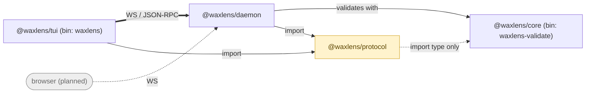

## What waxlens is

A **producer-independent validator** for [WACZ](https://specs.webrecorder.net/wacz/1.1.1/)
— the format that packages WARC data and its metadata into a ZIP file. Point it
at an archive and it reports, rule by rule, what conforms and what does not.

Producer-independent means it makes no assumptions about which tool wrote the
archive. It reads the ZIP as the spec describes it, so a WACZ from any recorder
is judged the same way.

## Two things it is not

It does not **replay** archives — that is [ReplayWeb.page](https://replayweb.page/)'s
job. And it does not **produce** them; when this site mentions BrowserHive, that
is a separate project whose output waxlens happens to check.

## How it is put together

The daemon is **stateless**, which is what lets a future browser frontend speak
the same protocol as the terminal UI. See [Architecture](/waxlens/architecture/).

## Where things are

| I want to… | Page |
| ---------- | ---- |
| validate an archive for the first time | [Quickstart](/waxlens/quickstart/) |
| know what each rule checks | [Rules](/waxlens/rules/) |
| understand `--profile` | [Profiles](/waxlens/profiles/) |
| consume `--json` output | [JSON report](/waxlens/json-report/) |
| see real failing archives | [Corpus](/waxlens/corpus/) |
| validate an `s3://` archive | [Docker Compose stack](/waxlens/compose/) |
