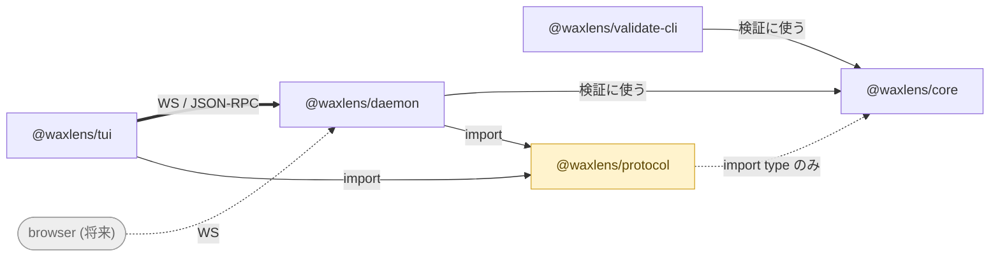

## 6 つの package

| Package | bin | 役割 |
| ------- | --- | ---- |
| `@waxlens/contract` | — | すべての面が従う共有語彙。rule profile・locale・CLI の exit code 契約。何にも依存しないので、browser クライアントが engine を引き込まずに使える。 |
| `@waxlens/core` | — | Validation engine。WACZ を読み、rule を実行し、machine-readable な report を返す。library であり、bin も `commander` も持たない。 |
| `@waxlens/validate-cli` | `waxlens-validate` | core の上に載る非対話コマンド。引数を解釈し、JSON report を書き、exit code を立てる。他を使わず CI から直接呼べる。 |
| `@waxlens/daemon` | `waxlens-daemon` | stateless な HTTP/WS daemon。core を所有し、解決済み(message / specUrl / conformance を inline した)report を返す。 |
| `@waxlens/tui` | `waxlens` | 対話的な terminal UI。daemon の薄いクライアント。 |
| `@waxlens/protocol` | — | クライアントと daemon が共有する wire 型と CLI 契約。runtime では core に依存しないので browser-safe。 |

`waxlens` は既定で `waxlens-daemon` を子プロセスとして起動します。常駐 daemon に
繋ぐ場合は、その daemon が起動時に出力した port を使って
`--server ws://127.0.0.1:7333` のように渡します（[クイックスタート](/waxlens/ja/quickstart/)参照）。

## なぜ daemon を挟むのか

validator は単一バイナリでも作れます。分離しているのは、**同じ report を
複数の frontend が提示できるようにする**ためです。



daemon が state を持たないことが、それを安価にしています。2 つ目の frontend は
新しいクライアントであって、engine の複製ではありません。

## core が prose を持たない理由

`@waxlens/core` は人間可読な文を一切生成しません。issue が持つのはメッセージの
**キー**とランタイム値で、renderer が locale カタログで解決します。

これが、1 つの report を複数言語で提示できる理由であり、`@waxlens/protocol` が
core 本体を引き込まずに core の型だけを使える理由でもあります — wire format は
テキストではなくデータです。

## rule もデータ

各 rule は `name` / `severity` / `conformance` と profile ごとの上書きを宣言し、
engine は個別に特別扱いせずその宣言を読みます。このサイトの
[Rules](/waxlens/ja/rules/) の表は同じ宣言から生成しているので、実際に走るものと
ずれません。

rule が有効になるのは、`packages/core/src/validate/rules/` に定義があり、**かつ**
同ディレクトリの `index.ts` に載っているときだけです。docs のビルドが両者の件数を
突き合わせます。

## 開発

```sh
pnpm install --frozen-lockfile   # workspace の依存 + symlink
pnpm check                       # audit + 各 workspace の check
pnpm build
```

`docs-site/` は意図的に pnpm workspace の**外**に置き、npm で install します。
workspace に入れると Astro のビルドスクリプトを `allowBuilds` の許可リストに
足すことになり、本体の install を壊すリスクを、得るものなく抱え込むからです。
