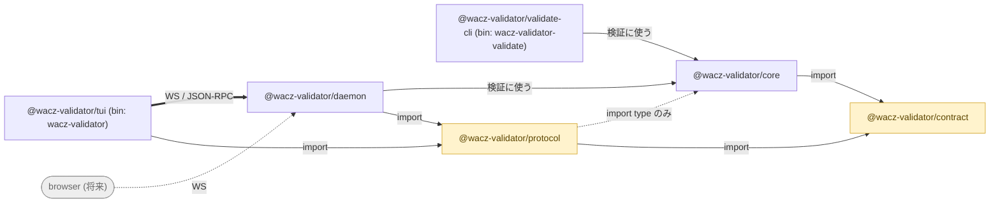

## wacz-validator とは

[WACZ](https://specs.webrecorder.net/wacz/1.1.1/)(WARC データとメタデータを
`ZIP file` にまとめた `Package`)の **producer 非依存な validator** です。
archive を渡すと、rule 単位で「何が適合し、何が適合しないか」を報告します。

producer 非依存とは、**どのツールが書いたかを前提にしない**という意味です。
spec が定める通りに `ZIP file` を読むので、どの recorder が生成した WACZ でも
同じ基準で判定します。

## 2 つの「やらないこと」

archive を **replay しません** — それは [ReplayWeb.page](https://replayweb.page/)
の仕事です。archive を **生成もしません**。このサイトに
BrowserHive が出てくる場合、
それは wacz-validator が検証する対象を生成する別プロジェクトを指します。

## 構成

daemon が **stateless** であることが、将来の browser frontend が terminal UI と
同じ protocol で繋げる理由です。[アーキテクチャ](/wacz-validator/ja/architecture/)を参照。

## 目的別の入口

| やりたいこと | ページ |
| ------------ | ------ |
| はじめて archive を検証する | [クイックスタート](/wacz-validator/ja/quickstart/) |
| 各 rule が何を見るか知る | [Rules](/wacz-validator/ja/rules/) |
| `--profile` を理解する | [プロファイル](/wacz-validator/ja/profiles/) |
| JSON 出力を使う | [JSON レポート](/wacz-validator/ja/json-report/) |
| 実際に失敗する archive を見る | [Corpus](https://uraitakahito.github.io/wacz-validator-corpus/ja/) |
| `s3://` の archive を検証する | [Apple Container スタック](/wacz-validator/ja/container/) |
